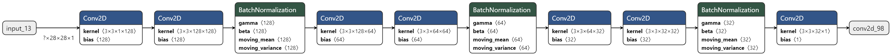
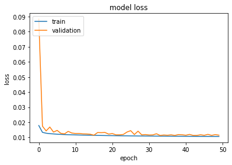
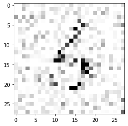
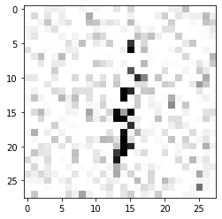
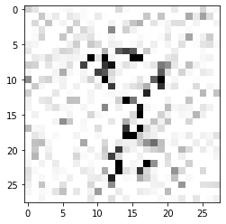
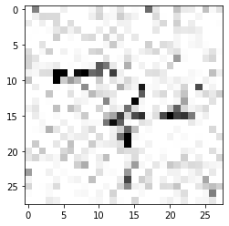
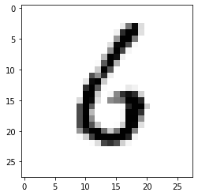
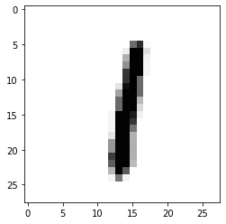
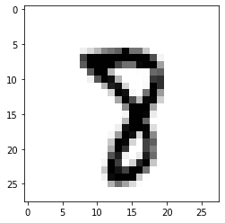
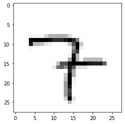

# CNN

## Presentation

The aim here is to debug an image using a convolution network. In addition, a database management tool has been set up in order to be able to construct in a simple and efficient 
way a dataset of the shape (noisy images, normal images) by providing a set of normal images. In this package, only the case of one shade of grey images is treated. An example of use with the MNIST database is available. The functions for preparing the noisy images are based on this [repository](https://github.com/mastnk/imagedegrade).

## Installation

The easiest way is the following :

``` 
!python3 -m pip install --ignore-installed -r requirements.txt 
```

## Example & Usage of dataset managing

The ```data.py``` file provide us a way to build and use easily your dataset. First, let's instance as follows:

```
dataset=Data(y_train,y_test)
```

where ```y_train``` and ```y_test``` are 3D-array representing your grayscale images dataset. Then, you can start building the noisy version of your images by using the code below :

```
dataset.build_train(saltp,noise)
```

where ```saltp``` is a float representing the probability of salter noise intensity and ```noise``` is the deviation of the gaussian blur applied. Then you can preprocess your data for the training with this command line :

```
dataset.preprocess()
```

As example, I initialized my dataset as follows : ```dataset=Data(x_train,x_test)``` where ```x_train``` and ```x_test``` are the train and test set of MNIST database (without any labels). Then I used previous code with ```saltp=0.7``` and ```noise=50```.

## Example & Usage of training model

The ```model.py``` file contains a Model class which can be initialized as follows :

```
model=Model(input_shape)
```

where ```input_shape``` is 3-tuple and where the last tuple is necessarily 1. Then you can apply the method ```.train(X,Y)``` and choose to save or not your model.

The built model is the following :

<td></td>

You can find below the history train of the model on the noisy MNIST database :

<td></td>

We have reached a minimum quickly for the mean-square error. The results on the test data are very positive :

<table>
  <tr>
    <td>Input</td>
    <td></td>
    <td></td>
    <td></td>
    <td></td>
  </tr>
  <tr>
    <td>Output</td>
    <td></td>
    <td></td>
    <td></td>
    <td></td>
  </tr>
 </table>
