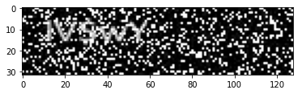
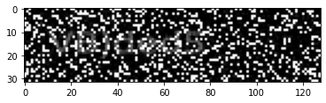

# CRNN

## Presentation

The aim here is to build a model able to recognize the text on a noisy and poor quality image. In this package, you also have the possibility to build quickly your own dataset 
with your choice of parameters of salt and gaussian noise. The structure of the text recognition model for training will be as follows :

<td></td>

## Installation

The easiest way is the following :

``` 
!python3 -m pip install --ignore-installed -r requirements.txt 
```

## Example and Usage

The ```data.py``` file provide us a way to build and use easily your dataset for the text recognition task. First, let's instance as follows:

```
dataset=Data(max_size,alphabet)
```

where ```max_size``` is an integer which represents the maximum size of your element in your dataset and ```alphabet``` is a string which is your alphabet. In my case, I instanced
as follows : ```dataset=Data(200000,'ABCDEFGHIJKLMNOPQRSTUVWXYZabcdefghijklmnopqrstuvwxyz0123456789- :./+=()&%€$;')```. The next step is to generate your data. You can use this 
command line :

```
dataset.build(directory/path/to/save/your/data)
```

Every 4024 data created, your dataset is saved as a ```pkl``` file in the specified directory. If you already have a dataset, please use the command 
```dataset.load_predata(directory/path/of/your/data)```. Your data must be a ```pkl``` file and saved as a tuple : ```(images,texts)```. Now, it is time to noise your images. To 
have a look quickly of the impact of parameters, please use the command as follows :

```
dataset.watch_impact_sample(saltp,noise)
```

where ```saltp``` is a float which represents the salt spread probability and ```noise``` the deviation of the gaussian blur applied. In my case, I took ```saltp = 0.2``` and 
```noise = 10``` :

<td></td>

You can now preprocess your data and save them for the training :```dataset.preprocess(saltp,noise,directory/path/to/save/your/data)```. Your data will be saved as a tuple : ```(training_set,validation_set,max_length_word,x_test,y_test)```. Notice that the dataset is split as follows : 10% for the test set and 90% for the training data of which 10% for the validation. In my case, the data size is 6.12 GO. Let's now instance a model with the ```Model``` class provide by the file  ```model.py``` :

```
model=Model(input_shape,alphabet)
```

where ```input_shape``` is a 3-tuple where the last coordinate is necessarily  a 1. Now, you have to set the CTC-loss by the command line as follows :

```
model.set_CTCloss(max_word_length)
```

and then you can start training your text recognition model :

```
model.train(training_set,validation_set,path/to/save/your/model,epochs=50,display=True)
```

In my case, we reach a CTC-score of 1.65036 after 50 epochs. You can see the training history below :

<td></td>

To make prediction, you need to load the model where you saved it : ```model.load_model(path/of/saved/model)``` and then make the prediction : ```text_predicted=model.pred(x_test)```. You can find below the results of the model on never seen data :

<table>
  <tr>
    <td>Text written</td>
    <td>DOxST</td>
    <td>lV$wY</td>
    <td>VB)ded5</td>
    <td>Vzmr€</td>
    <td>O2Si4p</td>
  </tr>
  <tr>
    <td>Input</td>
    <td></td>
    <td></td>
    <td></td>
    <td></td>
    <td></td>
  </tr>
  <tr>
    <td>Output</td>
    <td>DOxST</td>
    <td>IVSwY</td>
    <td>VB)ded5</td>
    <td>VzmrR</td>
    <td>O2Si4p</td>
  </tr>
 </table>
