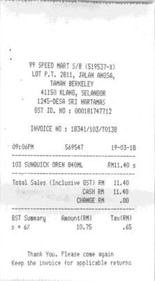
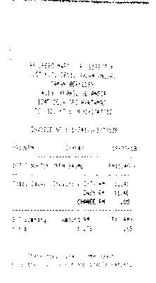
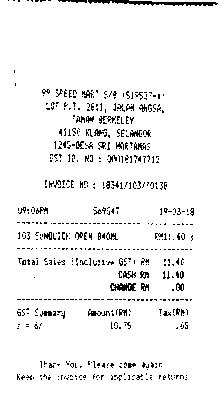
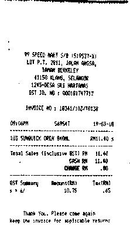
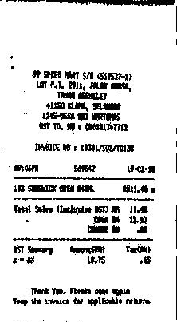
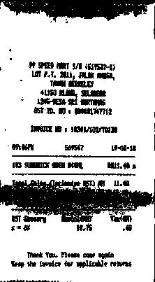

# HMM

## Presentation

Let's consider a grayscale image. The objective is to denoise it using image segmentation. To do this, we create an ```Image``` instance and, once we have transformed the 
image into a one-dimensional array with a Hilbert-Peano path, we apply the Expactation-Maximization algorithm to find a hidden Markov chain as likely as possible. 
Once this is done, inference is performed by transforming the sequence into a two-level colour sequence. All that remains is to reconstruct the image in two dimensions.

## Installation

The easiest way is the following :

``` 
!python3 -m pip install --ignore-installed -r requirements.txt 
```

## Example & Usage

First, we instance with the code as follows :

```
image=Image(path/to/your/image)
```

Then you can set the path curve adapted for your image and find the most probably number of hidden states with this 2 command lines :

```
image.setting()
image.set_components()
```

Before running the second command, don't forget to transform your 2D-image into a 1D-array by using : ``` .transform_1D() ```. This operation is reversible by using :```.transform_2D()```. You can finally train your hmm model on your image :

```
image.set_hmm_model()
```

You can also load a pre-trained hmm model by using ```.load_hmm_model(path/to/load/your/model)```. And it is possible to save your model with this command : ```.save_hmm_model(path/to/save/your/model)```.

Finally, you can clean your image with this command line :

```
image.clean_image(border)
```

where ```border``` is an integer to select the states you have decided to transform into a black pixel. The example below shows the influence of this parameter :

<table>
  <tr>
    <td>Invoice</td>
     <td>border = 10</td>
     <td>border = 20</td>
    <td>border = 30</td>
    <td>border = 40</td>
    <td>border = 50</td>
  </tr>
  <tr>
    <td></td>
    <td></td>
    <td></td>
    <td></td>
    <td></td>
    <td></td>
  </tr>
 </table>

This pre-processing can provide better input for a neural network than using the invoice directly for optimal character recognition.
